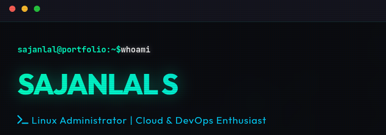

# You build it, you run it🐧
### DevOps  | Cybersecurity  | Networking 

*Bridging the gap between robust Networking, Fortified Security, and Automated DevOps.*

[Portfolio](https://sajanlalss.github.io/sajanlals-pf/) | [LinkedIn](https://linkedin.com/in/sanjanlal) | [Email](mailto:sanjanlal@example.com)

---

### 💫 Professional Overview
I am a technical expert with a multi-disciplinary background across **Networking, Cybersecurity, and DevOps**. I specialize in building secure, scalable, and highly monitored infrastructures using modern automation tools.

---

### 🛠️ Technical Arsenal

#### 🌐 Networking & Infrastructure
 

- **Certifications/Focus:** CCNA, VLAN, NAT, DHCP, DHCP Snooping
- **Specialty:** Advanced Network Troubleshooting & Topology Optimization

#### 🛡️ Cybersecurity & Pentesting
 

- **Skills:** Ethical Hacking, SQL Injection, Penetration Testing Tools
- **OS:** Specialist in Kali Linux for security audits.

#### 🚀 DevOps & IAAC (Infrastructure as Code)

 
 
 

- **IaC & Config:** Specialist in **Terraform, OpenTofu, and Ansible** for automated provisioning.
- **Pipelines:** Expert in CI/CD (Jenkins, GitHub Actions).
- **Languages:** Python, Shell Scripting, YAML.

#### 📊 Monitoring & Observability
 
 

- **Tools:** Zabbix, Grafana, Prometheus, Observium

#### 🖥️ Operating Systems & Enterprise Tools
 

- **Enterprise:** GLPI (ITSM), Matrix/Element (Self-hosted Communication)

---

### 📊 GitHub Activity

  
  

---

### 🤝 Connect with Me

